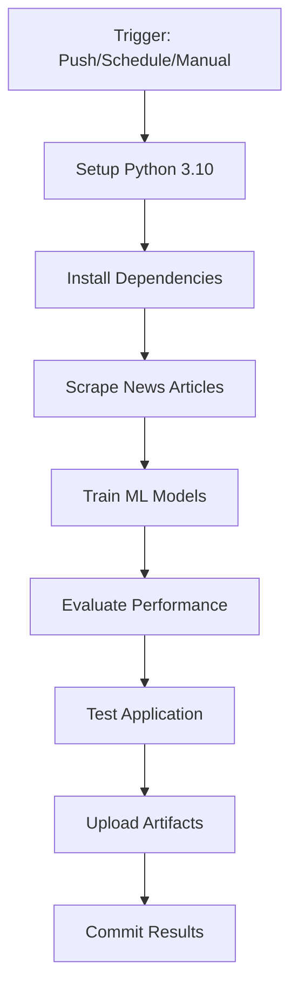

# 🚀 GitHub Setup & Actions Deployment Guide

## Step 1: Create GitHub Repository

1. Go to [GitHub.com](https://github.com) and sign in
2. Click the **"+"** button in the top right → **"New repository"**
3. Fill in repository details:
   - **Repository name**: `news-aggregator-ml` (or your preferred name)
   - **Description**: `AI-powered news aggregator with ML classification and automated pipeline`
   - **Visibility**: Choose **Public** (for free Actions) or **Private** 
   - **⚠️ Important**: Do NOT initialize with README, .gitignore, or license (we already have these)

## Step 2: Push Your Code to GitHub

```bash
# Add your GitHub repository as remote (replace YOUR_USERNAME and YOUR_REPO)
git remote add origin https://github.com/YOUR_USERNAME/YOUR_REPO.git

# Push your code to GitHub
git push -u origin main
```

**Example:**
```bash
git remote add origin https://github.com/johndoe/news-aggregator-ml.git
git push -u origin main
```

## Step 3: Verify GitHub Actions Setup

1. **Go to your repository on GitHub**
2. **Click the "Actions" tab**
3. **You should see**: "News Aggregator ML Pipeline" workflow
4. **Status**: Should show as ready to run

## Step 4: Test the Automated Pipeline

### Option A: Manual Trigger (Recommended for first test)
1. In the **Actions** tab, click **"News Aggregator ML Pipeline"**
2. Click **"Run workflow"** button on the right
3. Select **"main"** branch
4. Click **"Run workflow"**
5. **Watch it run!** ⏱️ Should take ~10-15 minutes

### Option B: Automatic Triggers
The pipeline will automatically run on:
- ✅ **Every Sunday at 2 AM UTC** (weekly schedule)
- ✅ **Every push to main/develop branches**
- ✅ **Every pull request to main**

## Step 5: Monitor Results

### View Logs
1. Click on any workflow run
2. Click on job names (e.g., "ml-pipeline")
3. Expand steps to see detailed logs

### Download Results
1. In completed workflow run, scroll to **"Artifacts"**
2. Download **"ml-pipeline-results.zip"**
3. Contains: trained models, evaluation metrics, processed data

### Success Indicators
✅ **Job 1: ml-pipeline** - Scrapes news, trains models, evaluates  
✅ **Job 2: test-application** - Tests all modules work correctly  
✅ **Job 3: deployment-ready** - Confirms system is production-ready  

## Step 6: Understanding the Workflow

### What Happens Each Run:


### Expected Output:
- **📰 Articles**: ~0-50 new articles per run
- **🎯 Accuracy**: >90% model performance
- **⏱️ Duration**: 10-15 minutes per run
- **💾 Storage**: Results saved as GitHub artifacts

## Step 7: Customization Options

### Change Schedule
Edit `.github/workflows/ml-pipeline.yml`:

```yaml
schedule:
  # Daily at 6 AM UTC
  - cron: '0 6 * * *'
  
  # Twice a week (Monday & Friday at 9 AM UTC)
  - cron: '0 9 * * 1,5'
```

### Add Notifications
Add to workflow for Slack/Discord notifications:

```yaml
- name: Notify Success
  if: success()
  run: |
    echo "✅ Pipeline completed successfully!"
    # Add your notification commands here
```

## Step 8: Cost Management

### GitHub Actions Limits:
- **Public repos**: ♾️ Unlimited minutes
- **Private repos**: 2000 minutes/month free
- **Current usage**: ~15 minutes/week = 60 minutes/month

### Cost Optimization:
- Uses **free tier** - no charges expected
- Runs **weekly** - minimal resource usage
- **CPU-only** processing - no GPU costs

## Step 9: Troubleshooting

### Common Issues:

**❌ "feedparser not found"**
- Solution: Dependencies install automatically in Actions

**❌ "No new articles scraped"**
- This is normal - RSS feeds may have no new content
- Pipeline continues with existing data

**❌ "Model accuracy low"**
- Normal for small datasets
- Performance improves as more articles are collected

**❌ "Workflow doesn't trigger"**
- Check `.github/workflows/` folder exists
- Verify YAML syntax is correct
- Ensure you're pushing to `main` branch

### Getting Help:
1. Check workflow logs in GitHub Actions tab
2. Look for red ❌ icons indicating failures
3. Common fixes are dependency updates or timeout adjustments

## Step 10: Next Steps

Once GitHub Actions is working:

1. **🔔 Set up notifications** for failures
2. **📊 Monitor weekly reports** in Actions tab
3. **🚀 Consider deployment** to cloud platforms
4. **📈 Add more news sources** to configs/config.yaml
5. **🤖 Enhance chatbot** with additional features

---

## 🎉 Success Checklist

- [ ] Repository created on GitHub
- [ ] Code pushed to `main` branch
- [ ] Actions tab shows workflow file
- [ ] First manual run completed successfully
- [ ] Artifacts downloaded and verified
- [ ] Weekly schedule confirmed active

**Congratulations! Your News Aggregator now runs automatically every week! 🚀**

---

## Quick Commands Reference

```bash
# Initial setup
git remote add origin https://github.com/YOUR_USERNAME/YOUR_REPO.git
git push -u origin main

# Future updates
git add .
git commit -m "Update: your changes"
git push

# Local testing
python main.py pipeline     # Run full pipeline locally
python main.py web         # Start web application
dvc repro --force          # Re-run DVC pipeline
```